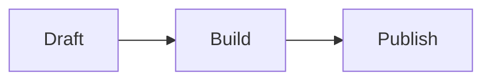

# Authoring Guide

This guide defines the Markdown dialect for this blog.

The goals are:

- plain Markdown source
- static HTML output
- simple text-first pages
- no raw HTML in posts
- predictable rendering for code, diagrams, and equations

## Post layout

Each post lives in its own folder:

```text
content/posts/<slug>/
  index.md
  assets/
    image.png
    screenshot.webp
```

Why this layout:

- the folder name is the post slug
- relative image paths stay stable
- post-local assets are easy to copy to the final site

## Front matter

Every post starts with YAML front matter:

```yaml
---
title: "Building a small blog with Go"
date: 2026-04-12
updated: 2026-04-12
summary: "A small static-first blog stack with Markdown, Go, Mermaid, and KaTeX."
draft: false
tags: ["go", "blog", "markdown"]
---
```

Required fields:

- `title`
- `date`
- `summary`

Optional fields:

- `updated`
- `draft`
- `tags`

Rules:

- `date` and `updated` use ISO format: `YYYY-MM-DD`
- the folder name is the canonical slug
- `title` in front matter is the only page title
- the article body should start with `##`, not `#`

## Headings

Use ATX headings only:

```md
## Section
### Subsection
```

Rules:

- do not use setext headings (`Title` followed by `===`)
- do not put a second `#` H1 inside the body
- keep headings short; they become anchor targets

## Code blocks

Use fenced code blocks only.

Normal case:

````md
```go
fmt.Println("hello")
```
````

If the code sample itself contains triple backticks, wrap the outer block with tildes:

````md
~~~~md
```go
fmt.Println("hello")
```
~~~~
````

Rules:

- always provide a language after the opening fence when the block is source code
- use backticks for ordinary code fences
- use tildes when the block content contains backticks
- reserve the language `mermaid` for diagrams only

## Diagrams

Write diagrams as Mermaid fences:

````md

````

Rules:

- one diagram per block
- keep labels short
- prefer SVG output in the build
- fix Mermaid syntax errors instead of falling back to screenshots

## Equations

Use these delimiters only:

Inline math:

```md
\(E = mc^2\)
```

Display math:

```md
$$
\int_0^1 x^2\,dx = \frac{1}{3}
$$
```

Rules:

- do not use single-dollar inline math (`$...$`)
- use `\(...\)` for inline math
- use `$$...$$` for display math
- when talking *about* math syntax literally, wrap it in backticks

## Images and assets

Store post-local files under `assets/` next to `index.md`.

Example:

```md

```

Rules:

- always include alt text
- prefer SVG or WebP when practical
- keep filenames lowercase and hyphenated

## Links

Internal post links should use canonical site paths:

```md
See [/posts/another-post/](/posts/another-post/).
```

Rules:

- prefer absolute site paths for internal links
- use normal Markdown links for external URLs
- avoid raw HTML anchors in post source

## Things that fail the build

The build should stop on:

- missing required front matter
- duplicate post slugs
- invalid Mermaid blocks
- invalid math
- broken local asset paths
- unresolved internal links

## Things that are warnings, not hard errors

These can be warnings at first:

- missing `updated`
- code block without a language
- summary longer than one sentence
- overly long headings

## Writing style

- keep paragraphs short
- prefer one idea per section
- use lists sparingly
- let spacing do most of the design work
- do not use raw HTML inside post source
