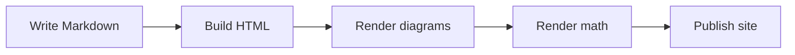

## Why this stack

I want a site that stays simple over time.

The content is written in Markdown. A small Go build step turns it into HTML. The published site is mostly plain HTML and CSS with very little runtime behavior.

## A small Go example

```go
package main

import "fmt"

func main() {
    fmt.Println("hello from a tiny blog")
}
```

## Build flow



## A little math

Inline math looks like \(E = mc^2\).

Display math looks like this:

$$
\int_0^1 x^2\,dx = \frac{1}{3}
$$

## Showing Markdown fences inside a post

When I need to show triple backticks literally, I wrap the outer example with tildes:

~~~~md
```go
fmt.Println("hello")
```
~~~~

## Local assets

A post can reference files stored next to it:


## Internal links

See [/posts/another-post/](/posts/another-post/).
