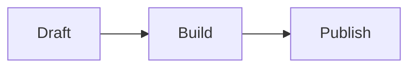
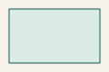

## Code

```go
package main

import "fmt"

func main() {
    fmt.Println("rich content")
}
```

## Diagram



## Math

Inline math looks like \(E = mc^2\).

$$
\int_0^1 x^2\,dx = \frac{1}{3}
$$

## Local asset



## Canonical link

See [this post](/posts/rich-content/).
